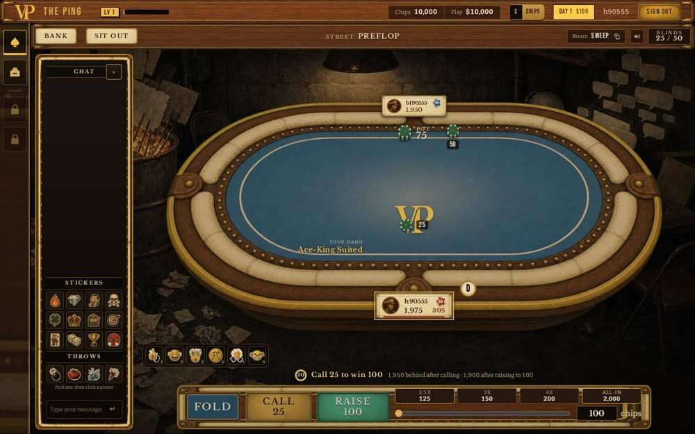
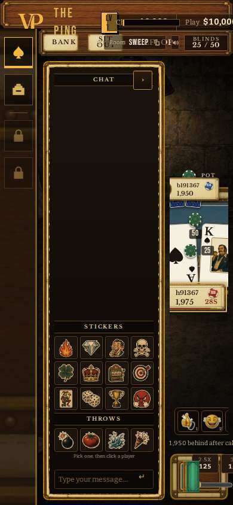
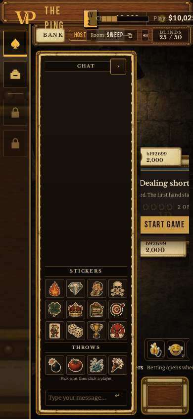
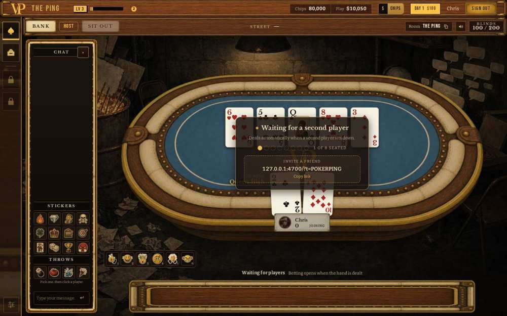
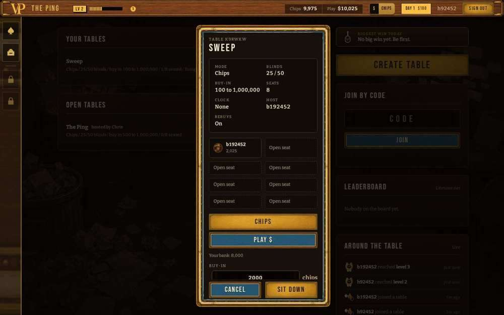
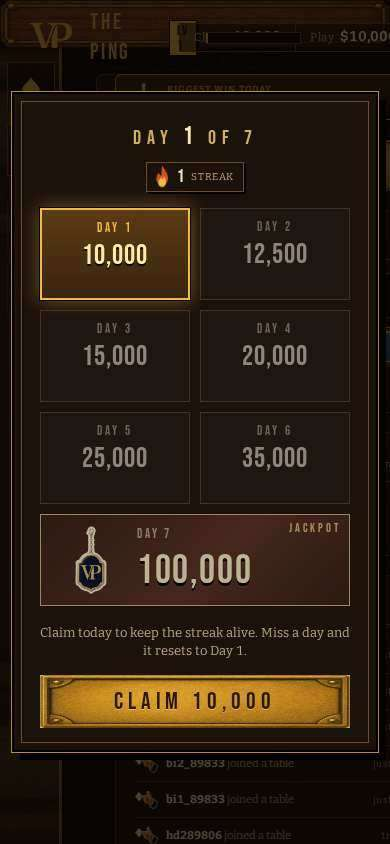
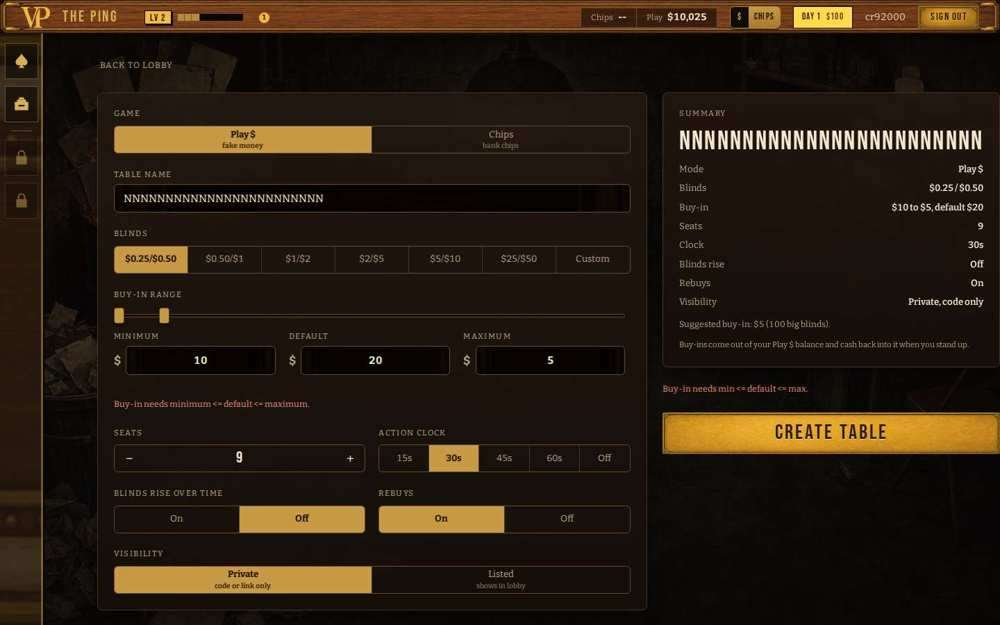
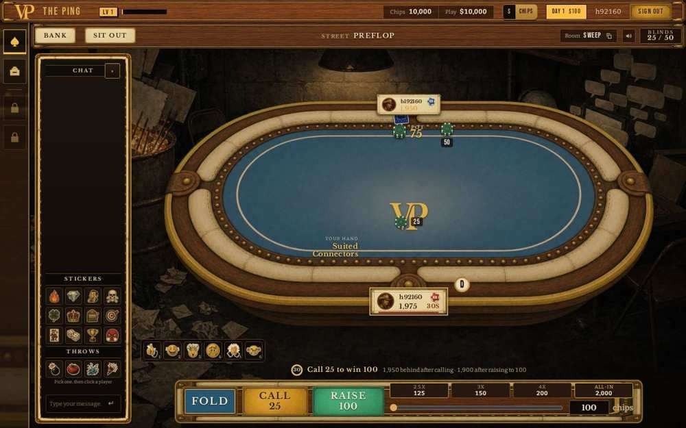

# QA-FRANK: browser playtest sweep of v2-core (P5)

Server under test: `repo/` head `60fbd32`, play money only, throwaway data. Re-run: `tests/e2e/sweep/run_all.sh`.

Severity: S1 money or stuck table, S2 wrong or misleading, S3 looks. Status: open, fixed (commit), known.

| id | sev | status | title |
|---|---|---|---|
| Q01 | S2 | open | Heads-up: SB and BB badges are swapped on the seats |
| Q02 | S2 | open | Phone width (390): header, lobby buttons and the action bar are off screen; the table cannot be played |
| Q03 | S2 | open | A player who already holds a seat is offered a buy-in form for it; the typed amount is silently ignored; a 0-chip seat shows a dead hand |
| Q04 | S2 | open | Daily bonus window prints raw cents with no unit |
| Q07 | S2 | open | Create-table refusals print amounts as raw cents on a Play $ form |
| Q08 | S2 | open | No control to leave a table with chips: the only Leave button is display:none |
| Q05 | S3 | open | A busted seat is labelled "JOINING" |
| Q06 | S3 | open | Create form: the seat stepper goes to 9, the server refuses 9 |

## Q01 (S2) Heads-up: SB and BB badges are swapped on the seats

- Status: open
- Steps: Heads-up table (2 seats), start a hand. Hero is the button.
- Expected: Button seat shows SB (posts the small blind, acts first preflop), the other shows BB.
- Actual: Hero (dealer, posted 25, first to act) is badged BB; the opponent (posted 50) is badged SB. Verified with players[0].isDealer true and roundBet 25 vs 50.
- Where: public/game.js:958-959 (client derives SB/BB as the two seats after the dealer; heads-up the dealer IS the small blind; also wrong when a seat is sitting out). The server knows hand.sbSeat/bbSeat but game_state does not carry them.
- Evidence: 

## Q02 (S2) Phone width (390): header, lobby buttons and the action bar are off screen; the table cannot be played

- Status: open
- Steps: Open the site at 390x844, sign in. Lobby, then sit at a table and wait for your turn.
- Expected: Every control reachable; Fold / Call / Raise usable.
- Actual: Measured by tests/e2e/sweep/s11_phone_geometry.py at 390x844. Lobby: money toggle, daily bonus, account and Sign out sit at x 430-749, CREATE TABLE / code box / JOIN reach x 435 (the page does not scroll). Table: the stage is 98 px wide (chat rail 204 px plus the dock take the rest), FOLD / CALL / RAISE are 22 px wide at x 298-334, emote buttons 3-6, the raise box and presets are off screen, the table is clipped. Moving the rail to the other side only mirrors it. A phone player can neither sign out nor act; the turn clock folds them.
- Where: public/*.css has no phone @media pass (client defects 1, 2, 14 from ui/REPORT were never started)
- Evidence: 
- Evidence: 

## Q03 (S2) A player who already holds a seat is offered a buy-in form for it; the typed amount is silently ignored; a 0-chip seat shows a dead hand

- Status: open
- Steps: (a) Disconnect on your turn (close the tab). Within 2 minutes sign in again from a fresh browser: lobby "Your tables" shows RESUME; press it. (b) Bust at a table, close the tab, sign in again and JOIN the same table from the lobby, type a buy-in (20000), Sit.
- Expected: (a) RESUME goes straight back to the seat. (b) Either the buy-in is taken as a rebuy, the rebuy panel appears, or the join is refused with a reason.
- Actual: (a) A table preview lists only the other player and shows "SIT DOWN" with Bank 8,000 and a 2000 buy-in; pressing it rebinds the held seat and charges nothing (bank 8000 -> 8000, seat 1975 -> 1975, verified with __audit), so the form lies about what happens. (b) table_joined stack 0, nothing charged (bank still 80,000), the page shows the previous hand's board and old hole cards, "Waiting for a second player", the seat reads "JOINING", no rebuy panel and no message. Evidence for (a): tests/e2e/sweep/s06c_disconnect.py.
- Where: tables/table.js rejoin path (seat exists -> rebind, buyIn ignored, no bust_out re-sent); public/game.js enter()
- Evidence: 
- Evidence: 

## Q04 (S2) Daily bonus window prints raw cents with no unit

- Status: open
- Steps: Sign up a new account. The daily bonus window opens.
- Expected: $100 / $125 ... $1,000 (Play $), as the header pill says "Day 1 $100".
- Actual: The window shows "10,000", "12,500" ... "100,000" and a CLAIM 10,000 button. The values are Play $ cents; a Chips-mode player reads them as 10,000 chips.
- Where: public/juice.js streakCalendar (renders schedule cents with toLocaleString); public/shell.js:331
- Evidence: 

## Q07 (S2) Create-table refusals print amounts as raw cents on a Play $ form

- Status: open
- Steps: Create form, Play $: set Minimum buy-in to $0.10 with $0.25/$0.50 blinds, press Create table.
- Expected: "Minimum buy-in is below the big blind (at least $0.50, you have $0.10)".
- Actual: "(at least 50, you have 10)": the cents are printed bare, so a $ form reads as $50 / $10.
- Where: public/lobby.js:863 formats server errors with S.cur.unit (no current table while creating -> chips)
- Evidence: 

## Q08 (S2) No control to leave a table with chips: the only Leave button is display:none

- Status: open
- Steps: Sit at any table with chips, look for a way to stand up and cash out (header, seat menu, bank panel, dock).
- Expected: A visible Leave / Stand up control that cashes the stack back to the bank.
- Actual: None. #btn-home exists with display:none and 0x0 size. A player can only close the tab and wait for the 2 minute disconnect grace (and only between hands) before the stack goes back to the bank, during which the seat shows as disconnected.
- Where: public/style.css:479 `.g-brand { display: none; }` hides #btn-home (public/index.html:60), the only in-game leave path; the bust panel Leave exists only at 0 chips. Same on master (style.css:470).
- Evidence: 

## Q05 (S3) A busted seat is labelled "JOINING"

- Status: open
- Steps: Lose all chips at a table; look at your seat and the opponent's seat.
- Expected: "Busted" / "Out of chips" (or Rebuying).
- Actual: Stack 0 seats read "JOINING", the same word used for a seat waiting for the next deal.
- Where: public/game.js:945 (sittingOut without sitOutRequest -> "Joining")
- Evidence: 

## Q06 (S3) Create form: the seat stepper goes to 9, the server refuses 9

- Status: open
- Steps: Create table form, press + on the seats stepper from 8.
- Expected: The stepper stops at 8.
- Actual: It shows 9. Submitting is refused with "Seat count is not supported (2 to 8, you have 9)" (a usable message, but the form should not offer it).
- Where: public/lobby.js:488-489 (Math.min(9, f.seats + 1)); contract: seats 2..8, 9 rejected
- Evidence: 

## Covered

- tests/e2e/*.py re-run on the merged build: 10 pass, rebuy_v2 and raise fail for stale-script reasons (see PROGRESS.md)
- s01 sign-up / daily bonus / header vs audit / sign out (desk)
- s02 hands vs the server in the browser: fold win, fold lose, showdown, split pot, side pots with a short all-in, all-in run-out, in Chips and Play $ (desk)
- s03 create form: every field vs the table the server made, limits
- s05 reload mid-hand, second tab take-over, transport drop and return
- s06 bust, rebuy default / limit reached / refused with chips, leave from the bust panel; s06b sit out, leave mid-hand and cash-out; s06c disconnect on turn, turn clock, return, 2 minute cash-out
- s07 host tools: pause/resume, blinds change mid-hand, kick mid-hand, end night and settle-up screen vs the server
- s08 admin console: columns vs audit, bank adjust by delta, over-draw refused, Play $ set
- s09 Ballot Bender: spins in both funds, balances vs audit
- s10 login lockout message, /api/admin/bender-config token gate

## NOT covered

- Phone (390x844) hands: the layout cannot be played (Q02); phone coverage is geometry on lobby and table only
- Cold Call: not in v2-core (origin/coldcall)
- radio and recap: only on the unmerged branch combo-1006
- Top-up screen: no client UI calls wallet_topup
- Bank panel inside a table with a seated player (Bank button) compared with the ledger: only the admin console columns were checked
- Windows/Safari/real mobile browsers: chromium only
